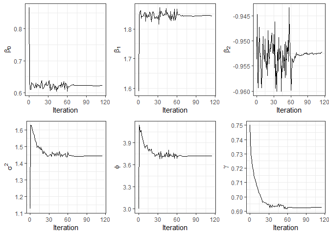

<!-- README.md is generated from README.Rmd. Please edit that file -->

## The `SPDEcensSpatial` package

<!-- badges: start -->
<!-- badges: end -->

The `SPDEcensSpatial` package fits a spatial censored linear regression
model using the Stochastic Approximation Expectation-Maximization (SAEM)
(Delyon, Lavielle, and Moulines 1999) algorithm. This algorithm is
particularly effective in calculating maximum likelihood (ML) estimates
for datasets with incomplete information. This model was formulated by
Ordoñez et al. (2018), and enhanced within the Bayesian framework by
Sahoo et al. (2024). Sahoo proposed to approximate the Gaussian spatial
process with Matérn correlation through a Gaussian Markov Random Field
(GMRF) derived from a stochastic partial differential equation,
introducing sparsity to the matrices and thereby significantly reducing
the computational costs associated with large datasets.

This package also approximates the standard error of the estimates using
the method developed by Louis (1982) and supports missing values on the
dependent variable. Moreover, it has a function that performs spatial
prediction in new locations.

The `SPDEcensSpatial` library provides the following functions:

- `SPDEsclm`: fits a spatial censored linear regression model via the
  SAEM algorithm.
- `predict.sclmSPDE`: performs spatial prediction in a set of new
  locations.

`print`, `summary`, `predict`, and `plot` functions also work for the
`sclmSPDE` class.

Next, we will describe how to install the package and use all the
previous methods in an artificial example.

### Example

In the following example, we simulate a dataset of length n = 220 from
the spatial linear regression model considering three covariates and the
Matérn correlation function with $\kappa=1$ to deal with the variation
between spatial points. In order to evaluate the prediction accuracy,
the dataset is train-test split. The training data consists of 200
observations, with 5% censored to the left, while the testing data
contains 20 observations.

``` r
library(RcppCensSpatial)
library(SPDEcensSpatial)

set.seed(12341)
n = 220
x = cbind(1, runif(n), rnorm(n))
coords = round(matrix(runif(2*n, 0, 15), n, 2), 5)
dat = rCensSp(beta=c(1,2,-1), sigma2=1, phi=4, nugget=0.50, x=x, coords=coords,
              cens='left', pcens=.05, npred=20, cov.model="matern", kappa=1)
# Proportion of censoring
table(dat$Data$ci)
#> 
#>   0   1 
#> 190  10
```

For comparison purposes, we fit the spatial censored linear model for
the simulated data using our model (using SPDE) and the function
`SAEM.sclm`, available in the library `RcppCensSpatial`.

``` r
data1 = dat$Data

# Our model
fit1 = SPDEsclm(data1$y, data1$x, data1$ci, data1$lcl, data1$ucl, data1$coords,
                phi0=3, gamma0=0.75, iedge=0.15, MaxIter=300, M=10)
fit1$tab
#>       beta0  beta1   beta2 sigma2    phi  gamma
#>      0.6227 1.8439 -0.9522 1.4445 3.7236 0.6925
#> s.e. 0.5988 0.1835  0.0530 0.4478 1.3186 0.0990
fit1$time
#> Time difference of 1.987562 mins

# RcppCensSpatial
fit2 = SAEM.sclm(data1$y, data1$x, data1$ci, data1$lcl, data1$ucl, data1$coords,
                 phi0=3, nugget0=1, type="matern", kappa=1, M=10)
fit2$tab
#>       beta0  beta1   beta2 sigma2    phi   tau2
#>      0.5742 1.8414 -0.9543 1.1162 3.7571 0.4075
#> s.e. 0.5413 0.1809  0.0524 0.6179 1.5631 0.0530
fit2$time
#> Time difference of 4.589155 mins
```

Note that the estimates obtained for each method are similar and close
to the true parameter value, except for the first regression
coefficient, which was estimated close to 0.60, while the true value was
equal to 1. Note also that the time needed for our proposal is lower
that the time required by the `RcppCensSpatial` package.

Moreover, generic functions `print` and `summary` return some results of
the fit for the `sclm` class, such as the estimated parameters, standard
errors, the effective range, the information criteria, and some
convergence details.

``` r
print(fit1)
#> ----------------------------------------------------------------
#>      Censored Linear Spatial Regression Model using SPDE   
#> ----------------------------------------------------------------
#> Call:
#> SPDEsclm(y = data1$y, x = data1$x, ci = data1$ci, lcl = data1$lcl, 
#>     ucl = data1$ucl, coords = data1$coords, phi0 = 3, gamma0 = 0.75, 
#>     iedge = 0.15, MaxIter = 300, M = 10)
#> 
#> Estimated parameters:
#>       beta0  beta1   beta2 sigma2    phi  gamma
#>      0.6227 1.8439 -0.9522 1.4445 3.7236 0.6925
#> s.e. 0.5988 0.1835  0.0530 0.4478 1.3186 0.0990
#> 
#> 
#> Model selection criteria:
#>         Loglik     AIC     BIC
#> Value -229.211 470.422 490.212
#> 
#> Details:
#> Number of censored/missing values: 10 
#> Convergence reached?: TRUE 
#> Iterations: 115 / 300 
#> Processing time: 1.9876 mins
```

On the other hand, the function `plot` provides convergence graphics for
the parameters.

``` r
plot(fit1)
```



Now, we compute the predicted values for each fitted model for the
testing data and compare the mean squared prediction error (MSPE).

``` r
data2 = dat$TestData
pred1 = predict(fit1, data2$x, data2$coords)
pred2 = predict(fit2, data2$coords, data2$x)

# Cross-validation
mean((data2$y - pred1$predValues)^2)
#> [1] 1.300523
mean((data2$y - pred2$predValues)^2)
#> [1] 1.271269
```

### References

<div id="refs" class="references csl-bib-body hanging-indent">

<div id="ref-delyon1999convergence" class="csl-entry">

Delyon, B., M. Lavielle, and E. Moulines. 1999. “Convergence of a
Stochastic Approximation Version of the EM Algorithm.” *The Annals of
Statistics* 27 (1): 94–128.

</div>

<div id="ref-louis1982finding" class="csl-entry">

Louis, T. A. 1982. “Finding the Observed Information Matrix When Using
the EM Algorithm.” *Journal of the Royal Statistical Society: Series B
(Methodological)* 44 (2): 226–33.

</div>

<div id="ref-ordonez2018geostatistical" class="csl-entry">

Ordoñez, J. A., D. Bandyopadhyay, V. H. Lachos, and C. R. B. Cabral.
2018. “Geostatistical Estimation and Prediction for Censored Responses.”
*Spatial Statistics* 23: 109–23.
<https://doi.org/10.1016/j.spasta.2017.12.001>.

</div>

<div id="ref-sahoo2024computationally" class="csl-entry">

Sahoo, Indranil, Suman Majumder, Arnab Hazra, Ana G Rappold, and
Dipankar Bandyopadhyay. 2024. “Computationally Scalable Bayesian SPDE
Modeling for Censored Spatial Responses.” *arXiv Preprint
arXiv:2403.15670*.

</div>

</div>
